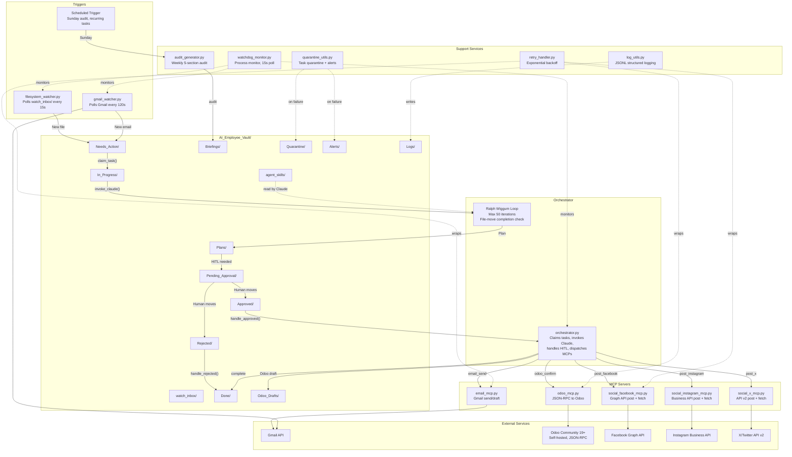

# Gold Tier Architecture — Personal AI Employee

**Version**: Gold v3.0.0 | **Generated**: 2026-02-15

## System Diagram



## Component Descriptions

### Watchers (Event Detection)

| Component | File | Purpose | Polling |
|-----------|------|---------|---------|
| Filesystem Watcher | `filesystem_watcher.py` | Detects files dropped into `watch_inbox/` | 15 seconds |
| Gmail Watcher | `gmail_watcher.py` | Detects unread emails via Gmail API | 120 seconds |
| Scheduled Trigger | Built into `orchestrator.py` | Sunday audit, recurring tasks | Per orchestrator cycle |

### Orchestrator (Central Brain)

| Component | File | Purpose |
|-----------|------|---------|
| Orchestrator | `orchestrator.py` | Claims tasks, invokes Claude with agent skills, creates plans, manages HITL workflow, dispatches to MCPs |
| Ralph Wiggum Loop | Inside `orchestrator.py` | Persistence loop for multi-step tasks: max 50 iterations, file-move completion check |

### MCP Servers (External Actions)

| Component | File | External Service | Actions |
|-----------|------|-----------------|---------|
| Email MCP | `email_mcp.py` | Gmail API | Send, draft |
| Odoo MCP | `odoo_mcp.py` | Odoo JSON-RPC | Create/confirm/cancel invoice, create/confirm payment, list, query |
| Facebook MCP | `social_facebook_mcp.py` | Graph API | Post to page, fetch activity |
| Instagram MCP | `social_instagram_mcp.py` | Business API | Post media, fetch activity |
| X/Twitter MCP | `social_x_mcp.py` | API v2 | Post tweet (or draft fallback), fetch activity |

### Support Services

| Component | File | Purpose |
|-----------|------|---------|
| Retry Handler | `retry_handler.py` | Exponential backoff (1s→2s→4s, max 60s, 3 retries) |
| Quarantine Utils | `quarantine_utils.py` | Move failed tasks to `Quarantine/`, create alerts in `Alerts/` |
| Log Utils | `log_utils.py` | JSONL structured logging with rich details |
| Watchdog | `watchdog_monitor.py` | Process monitor — restarts crashed watchers/orchestrator |
| Audit Generator | `audit_generator.py` | Weekly 5-section audit across Odoo + vault + social |
| Briefing Generator | `briefing_generator.py` | Legacy Silver briefing (retained, superseded by audit) |

### Agent Skills (Claude Intelligence)

| Skill | File | Purpose |
|-------|------|---------|
| Planning | `planning_skills.md` | Plan generation rules |
| Email | `email_skills.md` | Email parsing and reply drafting |
| Approval | `approval_skills.md` | HITL routing and thresholds |
| Social Post | `social_post_skills.md` | Multi-platform post drafting (LinkedIn, FB, IG, X) |
| Odoo | `odoo_skills.md` | Invoice/payment creation rules and field mappings |
| Social Summary | `social_summary_skills.md` | Engagement analysis across platforms |
| Audit | `audit_skills.md` | Revenue calculation, bottleneck detection, suggestions |
| Recovery | `recovery_skills.md` | Retry policies, quarantine criteria, degradation rules |

## Data Flow

```
File Drop / Email / Schedule
        │
        ▼
   watch_inbox/ or Gmail API
        │
        ▼
   Needs_Action/ (task file with YAML frontmatter)
        │
        ▼ claim_task() (move to In_Progress/)
   In_Progress/
        │
        ▼ invoke_claude() with agent_skills/
   Plans/ (Plan_*.md with action details)
        │
        ├── No external action → Done/
        │
        └── External action needed
                │
                ▼
        Pending_Approval/ (HITL gate)
                │
                ├── Human approves → Approved/
                │       │
                │       ▼ dispatch_mcp()
                │   MCP Server → External API
                │       │
                │       ▼
                │   Done/ (with result logged)
                │
                └── Human rejects → Rejected/
                        │
                        ▼
                    Done/ (status: rejected)
```

## Integration Points

- **Odoo**: JSON-RPC on `ODOO_URL` (default `http://localhost:8069`), database `ODOO_DB`
- **Gmail**: OAuth 2.0 via `credentials.json` / `token.json`
- **Facebook**: Page Access Token via Graph API v18.0
- **Instagram**: Business Account via Graph API v18.0
- **X/Twitter**: OAuth 1.0a via API v2 (paid tier for posting; free for reading)
- **All credentials**: Stored in `.env` (gitignored), loaded via `python-dotenv`
